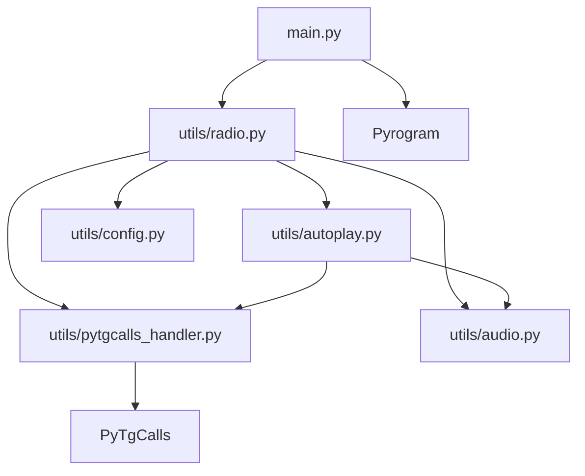

# 🔧 Технічна документація

## Залежності

### Основні пакети (requirements.txt)
- **pyrogram** - Telegram MTProto API framework
- **pytgcalls** - Voice chats integration
- **pyyaml** - YAML configuration parsing
- **ntgcalls** - Native calls backend
- **cryptg** - Fast cryptography for Pyrogram

### Встановлення
```bash
# Основні залежності
pip install -r requirements.txt

# Розробницькі залежності  
pip install -r requirements-dev.txt

# Альтернативний спосіб
pip install -e .
```

### Версії
- Python: 3.11+
- PyTgCalls: 2.2.5+
- Pyrogram: 2.0.106+

## Модульна структура



## Модулі

### main.py
**Призначення:** Головний файл з Pyrogram userbot  
**Функції:**
- Обробка команд адміністратора
- Фільтрація доступу
- Інтерфейс користувача

**Команди:**
```python
@app.on_message(filters.command("radio", prefixes=pref) & admin_filter)
async def radio_command(client, message)
```

### utils/config.py
**Призначення:** Завантаження та валідація конфігурації  
**Функції:**
- Читання YAML файлу з UTF-8
- Експорт глобальних змінних CONFIG та RADIO_CONFIG

**Експорт:**
```python
CONFIG = config
RADIO_CONFIG = config["radio_settings"]
```

### utils/audio.py
**Призначення:** Управління аудіо файлами  
**Функції:**
- `get_random_music()` - Випадковий музичний трек
- `get_random_jingle()` - Випадковий джингл
- `get_random_ads()` - Випадкова реклама
- `get_track_name()` - Витягування назви треку

**Підтримувані формати:** .mp3, .wav, .flac, .m4a, .ogg

### utils/pytgcalls_handler.py
**Призначення:** Низькорівнева робота з PyTgCalls  
**Функції:**
- `init_pytgcalls(client)` - Ініціалізація
- `start_pytgcalls()` - Запуск сервісу
- `play_audio_file(chat_id, file_path)` - Відтворення файлу
- `change_volume(chat_id, volume)` - Зміна гучності
- `check_connection(chat_id)` - Перевірка підключення

**Глобальні змінні:**
- `pytg` - Екземпляр PyTgCalls
- `current_volume` - Поточна гучність
- `is_started` - Статус запуску

### utils/autoplay.py
**Призначення:** Автоматичне відтворення контенту  
**Функції:**
- `auto_play_loop(chat_id)` - Основний цикл
- `next_music_instant(chat_id)` - Миттєве перемкнення
- `play_jingle_now(chat_id)` - Відтворення джингла
- `play_ads_now(chat_id)` - Відтворення реклами
- `stop_autoplay()` - Зупинка циклу

**Логіка планування:**
```python
if tracks_played % RADIO_CONFIG["ads_frequency"] == 0:
    # Реклама
elif tracks_played % RADIO_CONFIG["jingle_frequency"] == 0:
    # Джингл
else:
    # Музика
```

### utils/radio.py
**Призначення:** Високорівневий API  
**Функції:**
- `init_radio(client)` - Ініціалізація
- `join_voice(chat_id)` - Підключення до голосового чату
- `leave_voice(chat_id)` - Відключення
- `next_track(chat_id)` - Ручне перемкнення
- `set_volume(chat_id, volume)` - Управління гучністю

**Управління task'ами:**
```python
autoplay_task = asyncio.create_task(auto_play_loop(chat_id))
```

## Потік виконання

### Запуск радіо ($radio)
1. `main.py` отримує команду
2. Викликає `radio.join_voice()`
3. `radio.py` ініціалізує PyTgCalls
4. Відтворює перший трек
5. Запускає `autoplay.auto_play_loop()`
6. Цикл працює до відключення

### Автоматичний цикл
1. Чекає `track_duration` секунд
2. Перевіряє підключення
3. Збільшує лічільник треків
4. Визначає тип контенту за частотою
5. Відтворює контент
6. Повторює цикл

### Пріоритети контенту
1. **Реклама** - найвищий пріоритет
2. **Джингл** - середній пріоритет  
3. **Музика** - базовий контент

## Глобальні змінні

### autoplay.py
- `tracks_played` - Лічільник відтворених треків
- `autoplay_running` - Статус роботи циклу

### pytgcalls_handler.py
- `pytg` - Екземпляр PyTgCalls
- `is_started` - Статус запуску PyTgCalls
- `current_volume` - Поточна гучність
- `client_instance` - Pyrogram клієнт

### radio.py
- `autoplay_task` - AsyncIO task автоплей

## Обробка помилок

### Рівні обробки
1. **PyTgCalls рівень** - Базові помилки підключення
2. **Autoplay рівень** - Помилки відтворення, повторні спроби
3. **Radio рівень** - Помилки високого рівня
4. **Main рівень** - Помилки команд, відповіді користувачу

### Стратегії відновлення
- **Втрата підключення** - Автоматичний вихід з циклу
- **Помилка файлу** - Пропуск та перехід до наступного
- **Помилка гучності** - Логування без зупинки
- **Критичні помилки** - Зупинка з повідомленням

## Конфігурація

### Валідація
- Перевірка наявності обов'язкових полів
- Валідація типів даних
- Перевірка діапазонів значень

### Гарячі зміни
Для зміни конфігурації потрібен перезапуск бота.

### Безпека
- API ключі в конфігурації
- Фільтрація адміністраторів
- Валідація команд

## Тестування

### Ручне тестування
1. `$radio` - Перевірка підключення
2. `$next` - Перевірка перемкнення
3. `$vol` - Перевірка гучності
4. `$stop` - Перевірка відключення

### Юніт тести
```python
# Приклад тесту
async def test_get_random_music():
    music_file = get_random_music()
    assert music_file is not None
    assert os.path.exists(music_file)
```

## Оптимізація

### Продуктивність
- Асинхронна архітектура
- Мінімальне блокування операцій
- Ефективне управління файлами

### Пам'ять
- Немає зберігання великих об'єктів
- Своєчасне очищення task'ів
- Контрольоване використання глобальних змінних

## Розширення

### Додавання нових команд
1. Створити handler в `main.py`
2. Додати логіку в відповідний модуль
3. Оновити документацію

### Нові типи контенту
1. Розширити `audio.py`
2. Додати логіку в `autoplay.py`  
3. Оновити конфігурацію

### API інтеграції
- Можливість підключення веб API
- Інтеграція з музичними сервісами
- Системи аналітики

## Безпека

### Рекомендації
- Зберігати конфігурацію в безпечному місці
- Регулярно оновлювати залежності
- Обмежувати доступ до файлів бота
- Використовувати HTTPS для API

### Конфіденційність  
- API ключі не логуються
- Особисті дані не зберігаються
- Мінімальні права доступу

---

**Версія документації:** 1.0  
**Дата оновлення:** Серпень 2025
